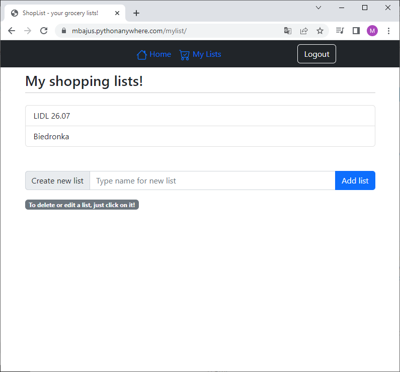

# ShopList webapp
> A Django webapp, in which you can create grocery lists.

## Table of contents
* [General info](#general-info)
* [Screenshots](#screenshots)
* [Technologies](#technologies)
* [Setup](#setup)
* [Features](#features)
* [Status](#status)

## General info
Made to improve Django skills. Simple web application to manage your shopping. You can create many different grocery list with a lot of items. Being at shop you can check and uncheck the items, so you know what is in your basket!

The app is on web [here](https://mbajus.pythonanywhere.com/), thanks to pythonanywhere.

## Screenshots

## Technologies
* Python 3.10
* Django 4.0
* Crispy forms

## Setup
To install and run app you will need to:
* Clone this repository to your computer or unpack .zip file in chosen directory,
* Run command line,
* Command to install demanded packages:
> pip install -r requirements.txt
* Run comand line,
* Type "cd YOUR_DIRECTORY\shoplist_django" in command line,
* Type "python manage.py migrate" in command line, 
* Type "python manage.py runserver 8000" in command line,
* Type "http://127.0.0.1:8000/" in your webbrowser.

## Features
* English version.
* You can add/delete your grocery lists and the items in it.
* Login system.

## Status
The app is ready to use, but I manage to add:
* sharing the lists with other users,
* more options to items (like quantity etc),
* polish, so my granny can use it.
